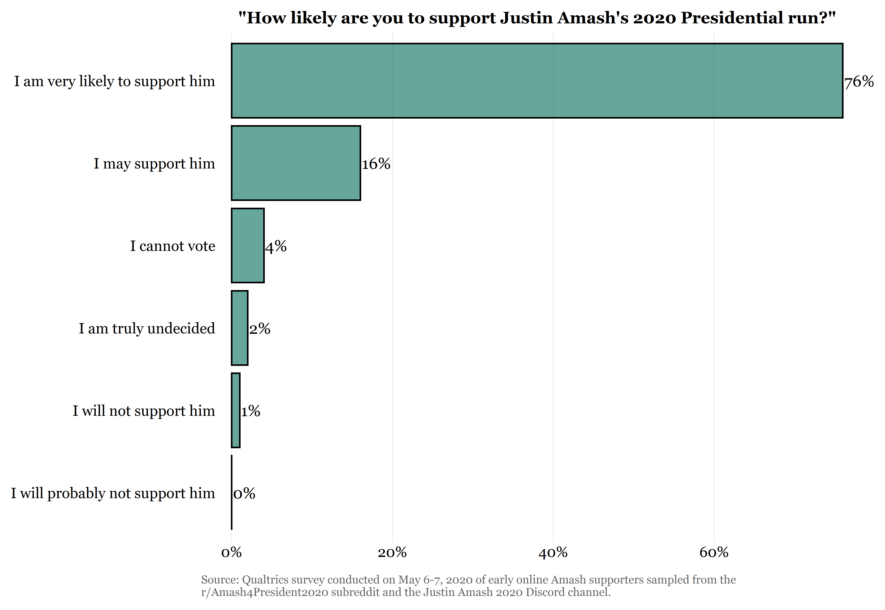
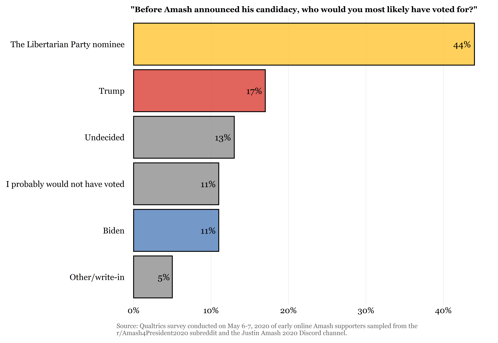
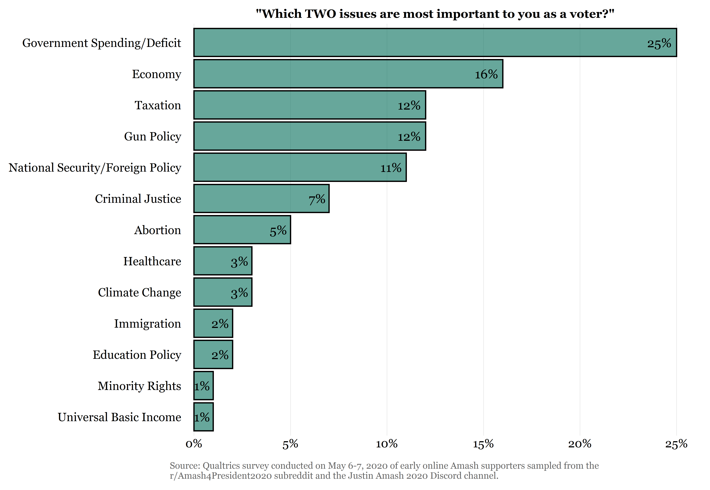
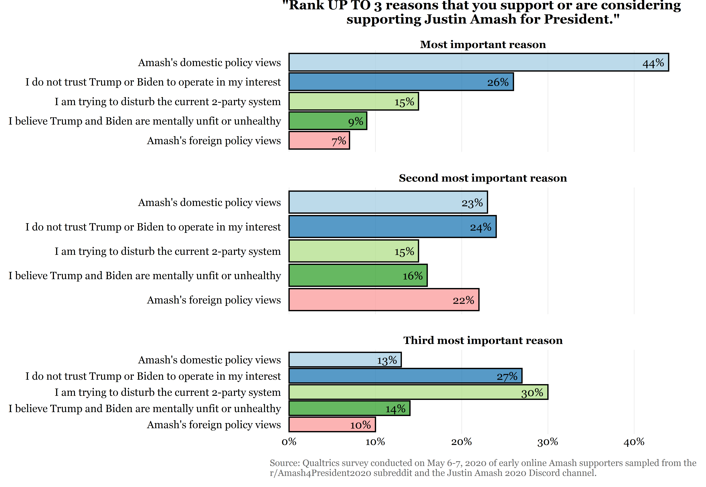

# Results of the Justin Amash Subreddit and Discord Survey
Suzie Mulesky

May 19, 2020

On May 6-7, I conducted a [survey](https://www.reddit.com/r/Amash4President2020/comments/getk1w/please_answer_a_4question_anonymous_survey_about/) of early online supporters of Justin Amash sampled from the r/Amash4President2020 subreddit and the Justin Amash 2020 Discord channel. I had done the analysis, and my pitch had been accepted for publication just before Amash dropped out! In case there is still interest in the results, I’m posting a synopsis here as well as access to the full survey data. This survey is based on responses from 279 participants.

For two additional write-ups of the analysis, see my subreddit post [here](https://www.reddit.com/r/Amash4President2020/comments/gmt09o/results_of_the_subreddit_and_discord_survey/) and my Twitter thread [here](https://twitter.com/SuzieMulesky/status/1262807080513220611). 

## “How likely are you to support Justin Amash’s 2020 Presidential run?”

## “Before Amash announced his candidacy, who would you most likely have voted for?”

Many political commentators, including prominent [Never-Trump](https://twitter.com/RadioFreeTom/status/1255312060310851584) [Republicans](https://twitter.com/gtconway3d/status/1255302421435289601), speculated that his candidacy would hand the election to Trump by siphoning votes from Joe Biden. This speculative commentary lacked data about the characteristics and attitudes of Amash supporters. To investigate, I asked Amash supporters who they would have voted for otherwise.

I found that the target support base for Amash, at least early on, did not appear to consist mainly of [“disillusioned Republicans”](https://www.washingtonpost.com/opinions/2020/04/29/amashs-run-is-bad-idea-is-he-relevant/) or moderate democrats.

* The largest support base came from those who would have voted for the Libertarian nominee anyway (44%).

* Importantly, early online Amash supporters were more likely to say they would have voted for Trump (17%) than Biden (11%). Among those who indicated they only may support Amash, Trump was nearly 3 times as likely to be their preferred candidate: 37% said they would have voted for Trump, but only 13% said they would have voted for Biden.

* Politically disengaged and protest-voters made up another significant source of support: 11% of Amash supporters would not have voted at all, and 5% would have written in or voted for a different third-party candidate. 13% were truly undecided about how they would have voted until Amash entered the race.

## “Which TWO issues are most important to you as a voter?”

Early online Amash supporters were not at all focused on typical Democratic party issues.

* Popular issues covered in the Democratic debates such as education policy, immigration, minority rights, healthcare, and climate change ranked among the lowest in importance to early online Amash supporters, with 3% or fewer choosing them as top issues.

* Instead, government spending/deficit (25%), the economy (16%), taxation (12%), gun policy (12%), and national security/foreign policy (11%) were the most important.

## “Rank UP TO 3 reasons that you support or are considering supporting Justin Amash for President.”

Amash supporters were primarily attracted to his domestic policy views (44%).

* A distrust in Trump or Biden to operate in their interest (26%) and a desire to disturb the current 2-party system (15%) served as common secondary reasons for supporting Amash.
* Some were principally worried about Trump and Biden’s mental or physical health (9%).

## Here is a brief overview of the files contained in this repository:

* [SurveyQuestionnaire.pdf](SurveyQuestionnaire.pdf) - survey questionnaire, hosted on Qualtrics

* [amash.csv](amash.csv) - cleaned and processed survey data

* [Processing.R](Processing.R) - R script used to clean and process the raw survey data

* [Visualization.R](Visualization.R) - R script used to create the graphs

* [Amash - Survey Questionnaire_May 8, 2020_10.43.csv](https://github.com/scmulesky/AmashRepo/blob/master/Amash%20-%20Survey%20Questionnaire_May%208%2C%202020_10.43.csv) - raw survey data downloaded from Qualtrics
